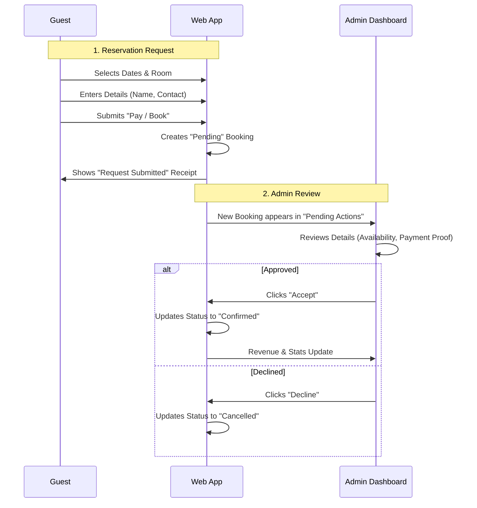

# Booking System Guide

This guide explains how the booking system in your Staycation template works, from the customer's perspective to the admin's management.

## The Booking Lifecycle

## detailed Flow

### 1. Customer Booking (The "Front Office")
*   **Discovery**: The guest browses rooms on the landing page.
*   **Availability**: When they open the booking modal, the `AvailabilityCalendar` checks if dates are free.
*   **Submission**:
    *   The guest fills out their info.
    *   When they click "Pay", the system currently **simulates** a payment (since this is a template).
    *   A new booking is created with status **`pending`**.
    *   **Why Pending?** In many small businesses (like staycations), you might want to manually verify a bank transfer screenshot or double-check the calendar before confirming.

### 2. Admin Management (The "Back Office")
*   **Notification**: You (the Admin) log in to the Dashboard.
*   **Pending Actions**: You see the new booking in the "Pending Actions" list (on the right side of the calendar, or top on mobile).
*   **Decision**:
    *   **Accept**: You confirm the money is in your bank/GCash and the room is ready. The booking becomes `confirmed`. It now fully blocks the calendar and counts towards revenue.
    *   **Decline**: If there's an issue (fake payment, double booking), you cancel it. The dates become free again.

## Terminology
*   **Pending**: Dates are tentatively blocked or requested. Money might not be confirmed yet.
*   **Confirmed**: Deal is done. Guest is expected.
*   **Cancelled**: Booking is invalid. Dates are open for others.

## Next Query Ideas
*   *How do I connect a real payment gateway like Stripe or PayMongo?*
*   *How do I send real emails to customers?*
